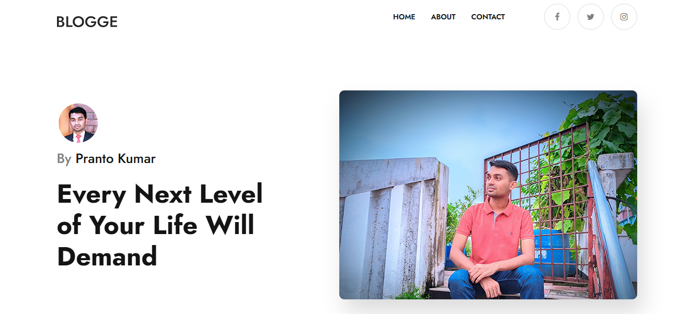
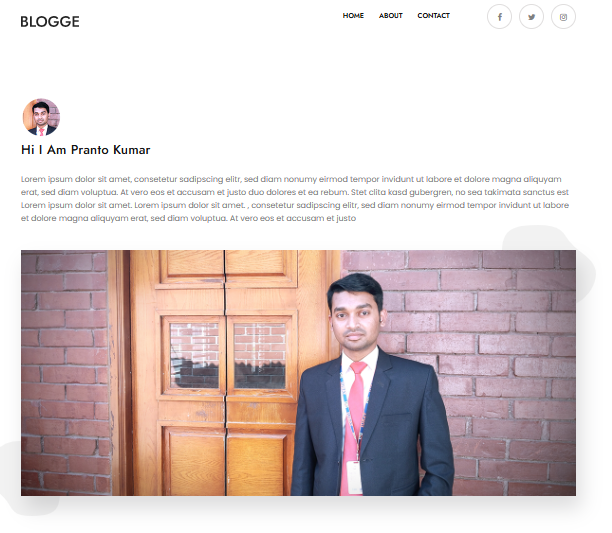
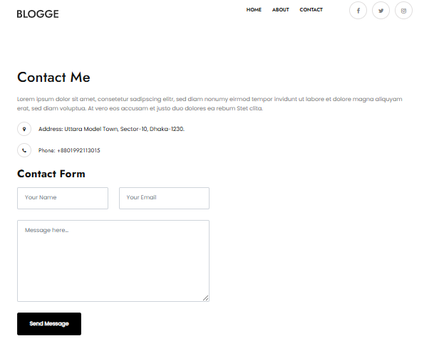
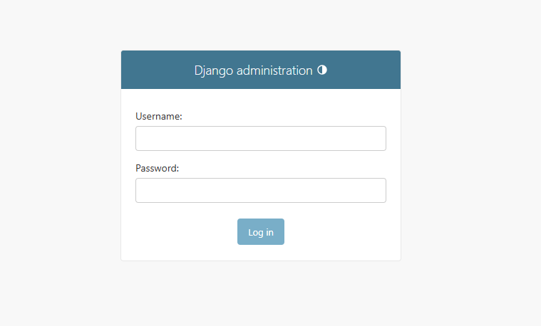
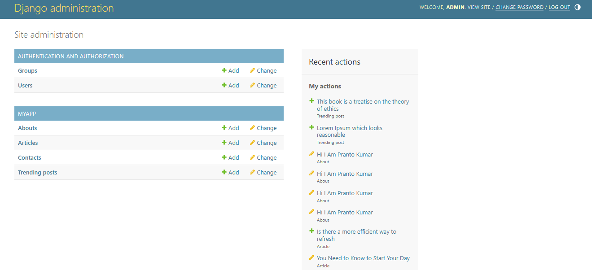

# Blog Wesite (Django)


## Demo Preview

**You can see the live demo project please [Click Here](https://pkcse.pythonanywhere.com/)**

## Technology Use
The blog website is built using the following technologies:

- HTML
- CSS
- Boostrap
- jquery
- SQLite Database
- Python
- Django

## Installation

### Prerequisite

- **Python v3.8.10 :**  [Downnload Link](https://www.python.org/ftp/python/3.8.10/python-3.8.10-amd64.exe)

- **VS Code Editor**  

To install and run the Blog Wesite locally, please follow these steps:
- Clone the repository : 

    ```sh
    git clone https://github.com/pranto113015/blog-website-django.git
    ```
- Now create and activate a virtual environment (optional but recommended): 
   
- On Windows :     
    ```sh
    python -m venv venvironment
    ```
    ```sh
    . venvironment/Scripts/activate
    ```
- Then navigate to the project directory : 
    ```sh
    cd myproject/
    ```
- Install the dependencies: 
    ```sh
    pip install -r requirements.txt
    ```
- Start the development server: 
    ```sh
    python manage.py runserver
    ```
- Open your web browser and access the application at http://localhost:8000

## Screenshots
- Home page


- About page


- Contact page


- Admin Panal


- Admin Dashboard



## Acknowledgments
- This website build for django course assignment final task.


## Contact

If you have any questions or need further clarification, please contact my Email / Linkedin .

- **💌 Email : pranto113015@gmail.com**

- **🕵️‍♂️ Linkedin : [Pranto Kumar](https://www.linkedin.com/in/pranto-kumar-a326801b3/)**

Thank you for reviewing my project 💙